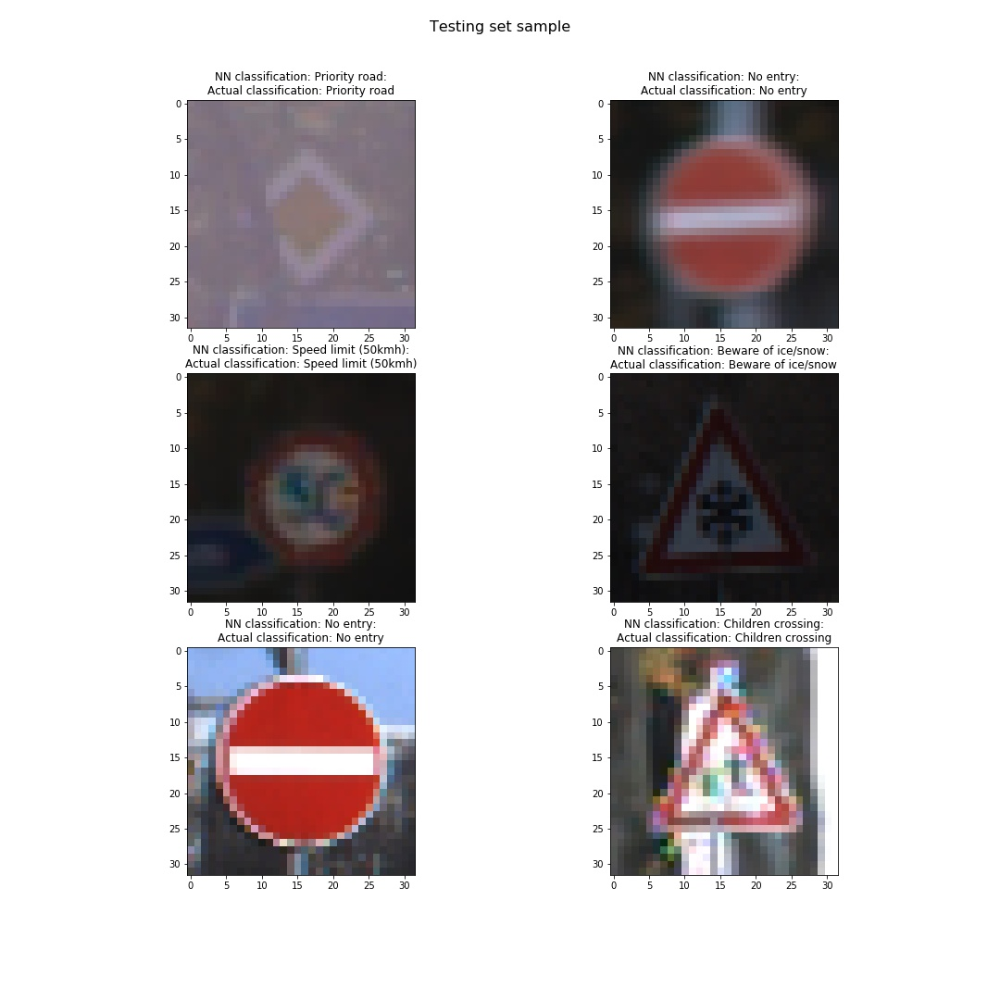

## Project: Build a Traffic Sign Recognition Program
[](http://www.udacity.com/drive)

## Overview

In this project, a convolutional neural networks is implemented and trained using `tensorflow` to classify traffic signs. The [German Traffic Sign Dataset](http://benchmark.ini.rub.de/?section=gtsrb&subsection=dataset) was used to train and validate the model. The model can then be used to classify images of any set of traffic sign images.


The goals / steps of this project are the following:
* Load the data set
* Explore, summarize and visualize the data set
* Design, train and test a model architecture
* Use the model to make predictions on new images
* Analyze the softmax probabilities of the new images
* Summarize the results with a written report

The project was built to meet this [rubric](https://review.udacity.com/#!/rubrics/481/view).

## Dependencies

* Python3 
* Tensorflow
* NumPy
* OpenCV
* Matplotlib

All the required packages can be found in Udacity's CarND Term1 conda environment. Click [here](https://github.com/udacity/CarND-Term1-Starter-Kit/blob/master/README.md) for the details.

## Usage

To run the CNN to classify a traffic sign jpg image, run the following command:
```
python run.py input_image output_directory
```

The python script will run the classification process and generate copies of the input images in the output_directory, with the name of each file being the output class of the neural network.

In case of multiple images, all the images must be placed in the same folder and the path to folder should be passed as the input_image.

Some sample test images are provided in `test_images/` with their respective outputs being in `test_output/`.

The below figure shows the result of runnung the NN on some images on the testing set of [German Traffic Sign Dataset](http://benchmark.ini.rub.de/?section=gtsrb&subsection=dataset):
 

## Neural Network Architecture

The NN used in this project utilizes a 2-stage ConvNet architecture with layer skipping follower by a couple fully connected layers. This architecture is highly inspired by this [paper](https://ieeexplore.ieee.org/document/6033589). A simple illustration of the NN can be seen below:


For more details regarding the neural network and the technical implementation, refer to the project's [technical writeup](technical_writeup.md) or [jupyter notebook](Traffic_Sign_Classifier.ipynb).